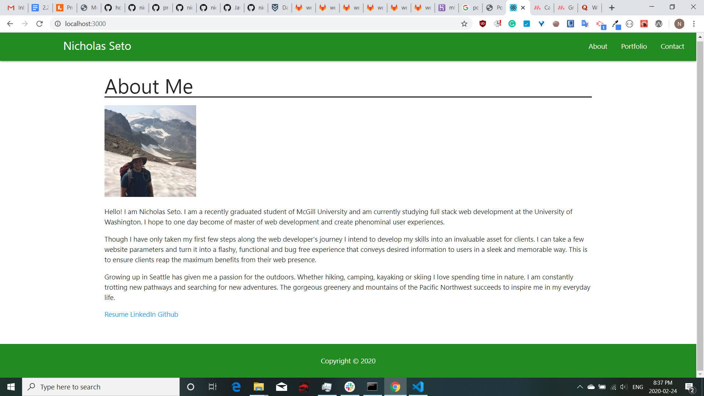

# React Portfolio
https://nickreactportfolio.herokuapp.com/portfolio

## Description

My Portfolio recreated utilizing React. Contains an About Me section, a Portfolio section and a Contact page. Contained in the About Me is a short bio statement as well as links to my Resume, Github and LinkedIn. The Portfolio page contains 6 highlighted projects with screenshots, links to github repository and links to the deployed application. The Contact page contains a currently nonfunctional contact form submission. This project utilizes Materialize for styling purposes.
